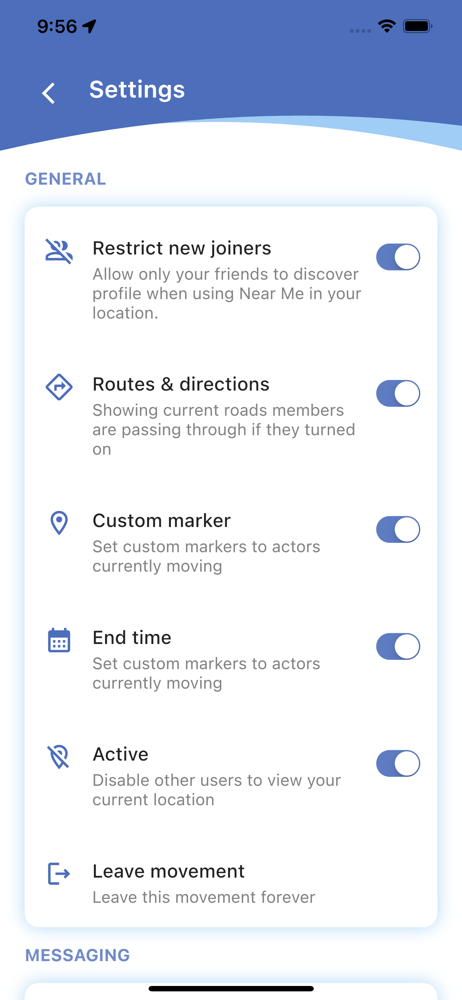

# Quick Step App - Flutter Mobile

Real-time live location tracking app built with Flutter, Google Maps, sockets, and Node.js. This full-stack app comes packed with features that allow you to easily view your current location and other users' real-time live location on Google Maps with custom markers.

In addition to real-time location tracking, this app also includes chat messaging functionality, allowing you to send or receive text messages from your colleagues in real-time. You can register and log in to the app, verify your account by email, and save your travels/trips locally on your phone.

### Features and functionalities

- View your current location and other's users real-time live location on Google Map with custom markers.
- Chat messages (send or receive text message by your colleague in real-time)
- Register user
- Login user
- Verifying account by email
- Send or resend OTP by email
- Creating, closing, deleting and leaving movement
- Inviting members to join movement
- View members within movement
- Joining or declining movement requests
- View or clear notification
- Create, Save, View saved, record or delete self-made trips
- Logging out a user
- Clearing trashes
- App icon and splash screen

### Get APK

Copy this URL (EDITED: Currently APK has issues due to backend deployment)

```bash
https://drive.google.com/file/d/1uVAM4gpTXExx2GmP78F1Gi7zIEmltBeO/view
```

Or click [here](https://drive.google.com/file/d/1uVAM4gpTXExx2GmP78F1Gi7zIEmltBeO/view)

### Screenshots

<p>
    
    
    
    
    
    
    
    
    
    
    
     
    
    
    
    
    
    
    
    
    
    
    
    
    
    
    
    
    
    
</p>

### Demo

- You can find full demo video of this app on YouTube via here: [https://www.youtube.com/watch?v=V_tnQ8OqVaw](https://www.youtube.com/watch?v=V_tnQ8OqVaw)

### Server

- This app is using node js as backend, you can find the whole source code of the backend server via here: [https://github.com/aimelive/quickstep-backend](https://github.com/aimelive/quickstep-backend)

### Run locally

- Clone this repository

```bash
git clone https://github.com/aimelive/quickstep_app
```

- Run the following command in your terminal to go into project root folder

```bash
cd quickstep_app
```

- Create `.env` file in `assets/dotenv/` folder and fill out all variables specified in `assets/dotenv/.env.example` file

#### Android

- - Go to `android/app/src/main/AndroidManifest.xml` file on line 42 and replace geo.API_KEY value with yours.

#### iOS

- - Go to `ios/Runner/AppDelegate.swift` file on line 11 and replaceAPIKey value with yours.
- Run the following command in your terminal to get all project dependencies

```bash
flutter pub get
```

- Launch your emulator, simulator or physical device where you'll run this project
- Run `flutter run` command in your terminal or press `F5` in your code editor to launch this project on selected device
- There you go, now you should be able to test the app and enjoy the best partners' location tracking

### Pre-requisites

- Flutter SDK (3.10.0)
- Android Studio for Android platform or XCode for iOS platform
- Google Map Api Key

### Technologies

- Google Map
- Dart/Flutter
- Socket.io
- GetX
- Hive
- Dio

### Platform

- Android ✅
- iOS ✅

### Some Use cases

- Order tracking
- Transport: bus tracking app
- Trips: colleagues location tracking
- Cycling: cyclist live location tracking
- Etc.

### Author

- [Aime Ndayambaje](https://github.com/aimelive)

### Contact Me

- For any ideas, suggestions, improvements, guidance or questions regarding this project, please contact me via my email [aimendayambaje24@gmail.com](mailto:aimendayambaje24@gmail.com) or LinkedIn [Aime Ndayambaje](https://linkedin.com/in/aime-ndayambaje)
### Note (Edited)
Currently APK has issues due to backend deployment, I advise you to run the project locally on PC by following the above instructions.
